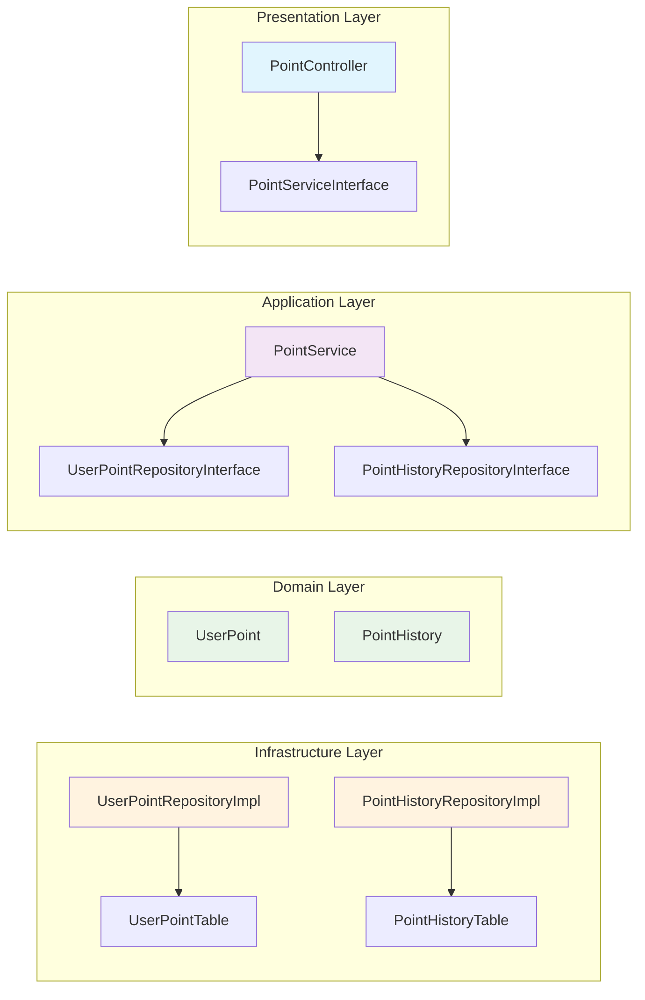
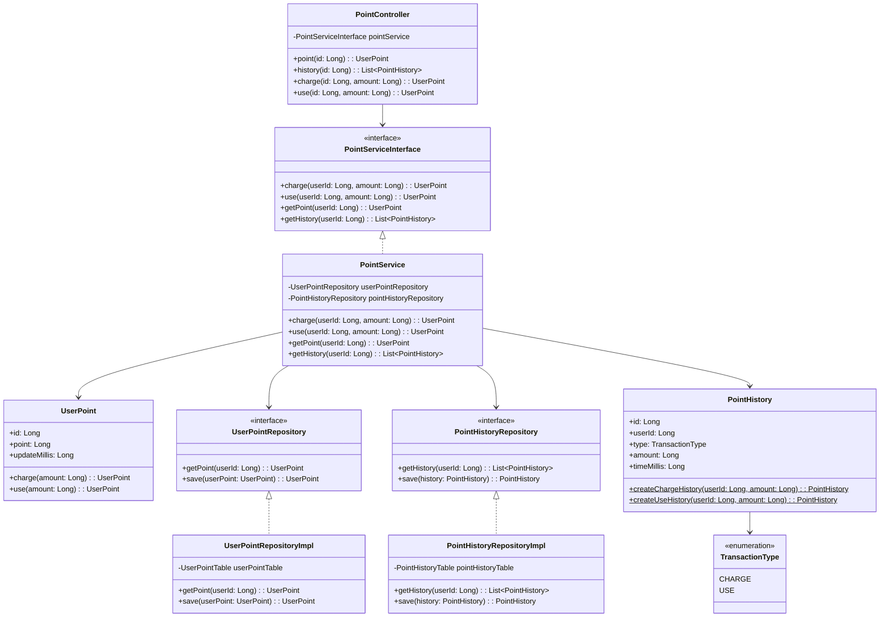
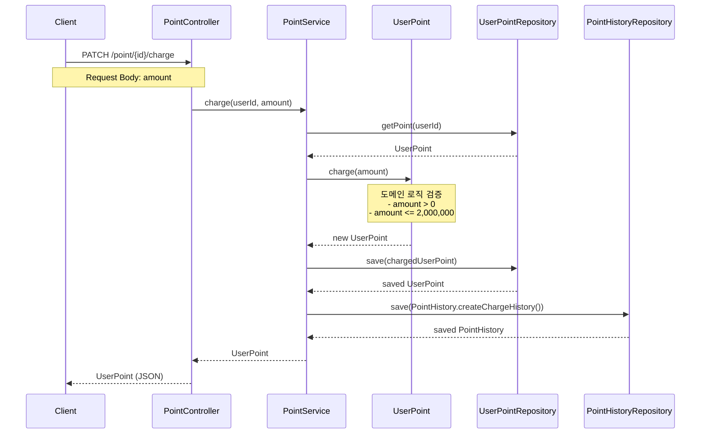
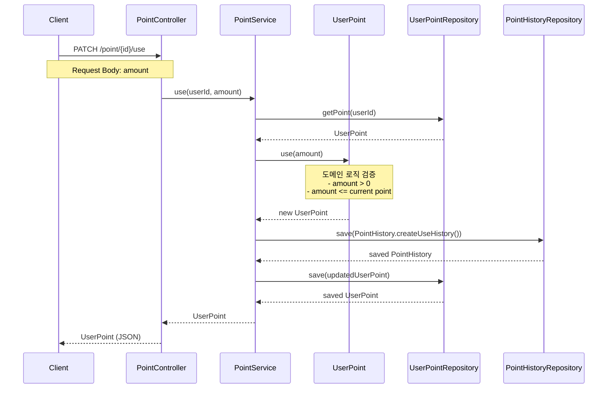

# User Point Management System

## 📖 개요
포인트 충전, 사용, 조회 기능을 제공하는 간단한 포인트 관리 시스템입니다. TDD(Test-Driven Development) 방법론과 Clean Architecture 원칙을 적용하여 구현했습니다.

## 🚀 애플리케이션 스펙

### 주요 기능
- **포인트 조회**: 특정 유저의 현재 포인트 조회
- **포인트 충전**: 유저 포인트 충전 (최대 2,000,000 포인트)
- **포인트 사용**: 유저 포인트 사용 (잔액 범위 내)
- **포인트 이력 조회**: 유저의 포인트 충전/사용 내역 조회

### API 엔드포인트
| Method | Endpoint | Description |
|--------|----------|-------------|
| GET | `/point/{id}` | 포인트 조회 |
| GET | `/point/{id}/histories` | 포인트 이력 조회 |
| PATCH | `/point/{id}/charge` | 포인트 충전 |
| PATCH | `/point/{id}/use` | 포인트 사용 |

### 기술 스택
- **Language**: Kotlin
- **Framework**: Spring Boot 3.x
- **Build Tool**: Gradle (Kotlin DSL)
- **Testing**: JUnit 5, MockK
- **Java Version**: 17

## 🏛️ Clean Architecture 적용

### 아키텍처 특징
본 프로젝트는 Clean Architecture 원칙을 적용하여 다음과 같은 특징을 가집니다:

1. **레이어 분리**: Controller, Service, Domain, Infrastructure 레이어로 명확한 책임 분리
2. **의존성 역전**: `controller -> service -> (domain) -> infra` 순으로 상위에서 하위 계층으로 의존성이 필요한 구조에서 최대한 의존성 역전 원칙을 적용하여 상위 레이어가 하위 레이어에 직접 의존하지 않도록 설계
3. **테스트 용이성**: 각 레이어별 독립적인 테스트 가능
4. **변경 격리**: 외부 시스템 변경이 비즈니스 로직에 미치는 영향 최소화

### 패키지 구조
```
src/main/kotlin/io/hhplus/tdd/
├── controller/          # 📡 외부 인터페이스 (Web Layer)
│   └── point/
│       ├── PointController.kt
│       └── PointServiceInterface.kt
├── point/
│   ├── service/         # 🔧 비즈니스 로직 (Application Layer)
│   │   └── PointService.kt
│   ├── domain/          # 🏛️ 핵심 비즈니스 규칙 (Domain Layer)
│   │   ├── UserPoint.kt
│   │   └── PointHistory.kt
│   └── repository/      # 📋 데이터 접근 인터페이스
│       ├── UserPointRepository.kt
│       └── PointHistoryRepository.kt
└── infra/              # 🔌 외부 시스템 연동 (Infrastructure Layer)
    └── point/
        ├── database/    # 데이터베이스 테이블
        └── persistence/ # Repository 구현체
```

### 의존성 역전 원칙 적용
- **Controller**: `ServiceInterface` 에 의존하여 구체적인 서비스 계층에 의존하지 않음
- **Service**: `Repository` 인터페이스에 의존하여 인프라 계층에 의존하지 않음
- **Domain**: 외부 의존성 없는 도메인의 순수 비즈니스 로직
- **Infrastructure**: 도메인과 애플리케이션 레이어의 인터페이스를 구현, 외부 시스템과의 연동을 담당

## 📊 아키텍처 다이어그램

### 전체 시스템 아키텍처


### 클래스 다이어그램


### 포인트 충전 시퀀스 다이어그램


### 포인트 사용 시퀀스 다이어그램



## 🧪 테스트 전략 및 보고서 작성

### 테스트 구조
- **단위 테스트**: 각 도메인 객체와 서비스 로직의 개별 테스트
- **통합 테스트**: 전체 플로우의 통합 테스트
- **동시성 테스트**: `@Synchronized` 어노테이션을 통한 동시성 이슈 해결 검증
- **성능 개선**: 기존 `@Synchronized` 활용 시 전체 메서드 단위 락으로 성능 저하 문제점 발견 -> 유저 포인트 관련하여, 사용자별 세밀한 락 제어로 변경(`ConcurrentHashMap<Long, ReentrantLock>()` 활용)

### 주요 테스트 케이스
- 포인트 충전/사용 성공 케이스
- 비즈니스 규칙 위반 케이스 (잔액 부족, 한도 초과 등)
- 동시성 환경에서의 포인트 충전/사용 테스트

## 🔧 주요 설계 결정사항

### 1. 동시성 테스트 설계
- 동시성 테스트 코드 작성 시, `CountDownLatch`를 사용하여 100개의 스레드가 동시에 포인트 충전 요청을 보내는 테스트를 작성했습니다.
  - 장점 : `CompletableFuture`와 비교하여, 테스트 코드가 간단하고 명확하며, 스레드에서 동시 시작, 종료를 쉽게 제어할 수 있습니다.
  - 단점 : `CompletableFuture`와 비교하여, 비동기 작업의 결과를 처리하는 데 다양한 콜백을 사용하기 어렵습니다.
  - 관련 보고서 : [동시성 테스트 설계](docs/동시성%20이슈와%20해결방법%20분석%20보고서.md)

### 2. 동시성 이슈 해결 - @Synchronized, ConcurrentHashMap<Long, ReentrantLock>()
- 포인트 충전과 사용 메소드에 `@Synchronized` 어노테이션을 적용하여 동시성 이슈를 해결했습니다.
    - 장점 : 이 방식은 JVM 레벨에서 스레드 안전성을 보장하며, 구현이 간단하고 직관적입니다.
    - 단점 : 전체 메서드 단위로 락을 걸기 때문에 성능 저하가 발생할 수 있으며, 단일 JVM 내에서만 동작합니다.
    - 개선 : 기존 `@Synchronized`의 성능 저하 문제 -> 사용자별 세밀한 락 제어로 변경(`ConcurrentHashMap<Long, ReentrantLock>()` 활용)
    - 관련 보고서 : [동시성 이슈 해결 방법 비교](docs/동시성%20이슈와%20해결방법%20분석%20보고서.md)

### 3. 도메인 주도 설계
`UserPoint`와 `PointHistory` 도메인 객체에 비즈니스 로직을 캡슐화하여 응집도를 높였습니다.

### 4. 인터페이스 분리 원칙
각 레이어 간 인터페이스를 정의하여 구현체에 대한 의존성을 제거했습니다.

### 5. 팩토리 메소드 패턴
`PointHistory`에서 충전/사용 히스토리 생성을 위한 팩토리 메소드를 제공합니다.

---

💡 **참고**: 이 프로젝트는 TDD 방법론을 적용하여 테스트 먼저 작성 후 구현하는 방식으로 개발되었습니다.

💡 **TDD 공부 후 정리된 지식**: 
- 단위 테스트와 통합 테스트의 기준은 회사마다 사람마다 다르다. 아래 규칙을 따르는 것이 좋아 보인다.
```
단위 테스트 : 대상 객체만 "실체" 로 두고 테스트
- 대상 객체의 고유 기능

통합 테스트 : 두개 이상의 객체를 "실체" 로 두고 테스트
- 유기적인 동작의 기능
```

- Mock 은 행위 검증, Stub은 상태 검증에 활용되는 테스트 더블이며, Mock 테스트 시 반드시 행위 검증(verify)를 포함시키자
  - 서비스.포인트 충전의 고유 기능이란? -> 포인트를 조회 후, 충전 시키고, 그 결과를 저장하고, 내역도 저장한다.
```
포인트 충전() {
	포인트 조회
	포인트 충전
	---> stub을 설정하여, 예외가 발생하도록 세팅한다.
	포인트 저장
	포인트 내역 저장 <--- mock 설정하여, 해당 부분도 행위 검증 필수
	return 포인트;
}

verify(포인트 내역 저장이 0번 호출 되었는가);
```

- 실패 TestCode(TC)를 다양하게 생각해보고, 뾰족하게(민감하게) 테스트 코드를 작성하자
```
테스트 "포인트 충전이 실패하면, 포인트 내역과 포인트 변경분은 저장되지 않는다"() {
      //given
	  충전 실패되는 stub 을 세팅 
	  
	  //when(행위)
	  서비스.포인트 충전()
	  
	  //then(assert부분)
	  verify(포인트 저장, 0번)
	  verify(내역 저장, 0번)
```
